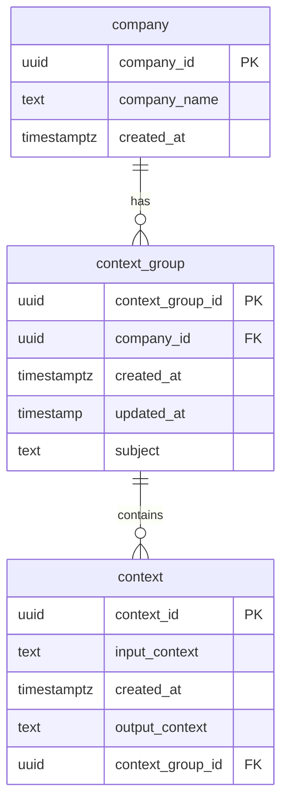
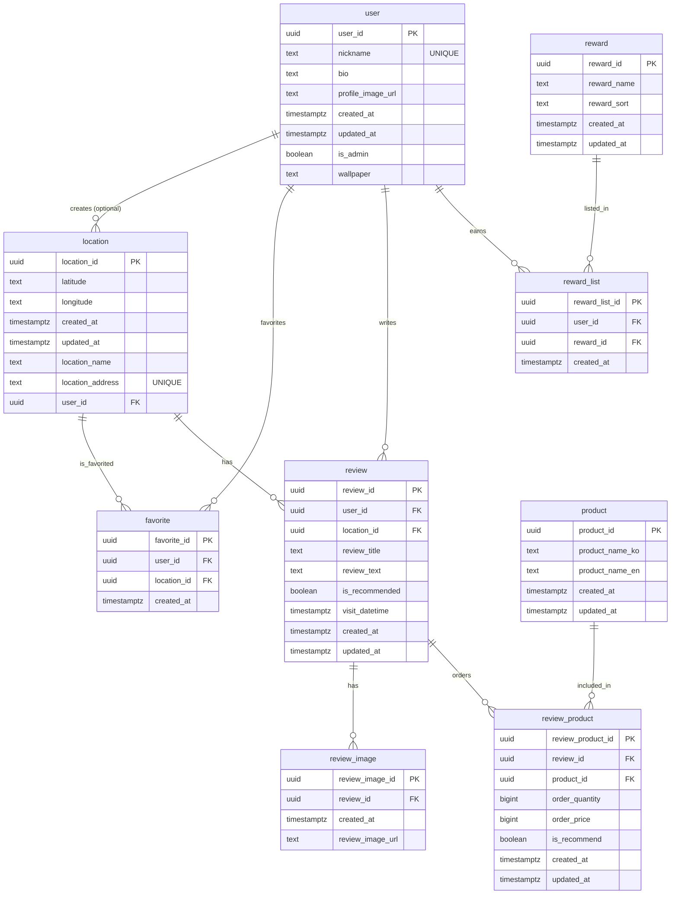

# 프로젝트

## [개인] 포트폴리오

- 학습된 컨텍스트를 기반으로 맞춤형 정보를 전달하는 AI Agent 포트폴리오

### Outline

- 기간: 2026. 2. 18 ~
- 스킬
  - 프레임워크: Vite, TypeScript, React.js, Next.js
  - 핵심 라이브러리: @anthropic-ai/sdk, @next/third-parties
  - 주요 라이브러리: React-markdown, Remark-gfm, Zustand, Biome, Tailwind CSS, Shadcn
  - 배포: Vercel
  - 문서: Notion
  - Data: Supabase, Google Analytics
  - DX: Claude Code, Codex, Notion MCP, Supabase MCP, Vercel MCP, Github MCP, Slack, Discord
- 관련 링크: [Service](https://jjmullan.vercel.app/), [Github](https://github.com/jjmullan/portfolio)

### ERD

### Technical Experience

1. Claude AI SDK 기반 스트리밍 응답 구현

- Next.js Route Handler 에서 Anthropic SDK 를 결합하여 AI 응답을 청크 단위로 클라이언트에 전달하는 스트리밍 파이프라인 구축
- 스트리밍 도중 에러 발생 시 HTTP 상태 코드를 변경할 수 없는 제약을 고려하여, `[STREAM_ERROR]:` 접두사를 스트림에 삽입하는 방식으로 클라이언트가 에러를 식별하도록 설계
- `react-markdown` + `remark-gfm` 으로 AI 응답을 GitHub Flavored Markdown 으로 실시간 렌더링하고, 스트리밍 중 커서 애니메이션으로 UX 개선

2. Anthropic Prompt Caching 으로 API 비용 최적화

- `cache_control: { type: 'ephemeral' }` 설정으로 시스템 프롬프트를 Anthropic 서버에 5분간 캐싱하여 반복 요청의 토큰 비용을 최대 90% 절감
- 포트폴리오 데이터를 TypeScript 상수 대신 역할별 Markdown 파일(`01_resume`, `02_project` 등)로 분리하고, `server-only` 가 적용된 `loadAllTemplates()` 로 동적 로드하여 코드 변경 없이 프롬프트 내용 관리가 가능하도록 설계

3. Zustand sessionStorage Persist 기반 SSR/CSR 하이드레이션 불일치 방지

- 채용 담당자의 `company_id`, `companyName` 을 `sessionStorage` 에 persist 하여 페이지 새로고침 후에도 세션 단위 상태를 유지
- `_hasHydrated` 플래그와 `onRehydrateStorage` 콜백을 활용하여 sessionStorage 복원 완료 후에만 모달을 렌더링함으로써 SSR 환경에서의 하이드레이션 불일치 방지

4. Supabase RLS 정책 및 DB 트리거 설계

- `company_id` 를 기준으로 대화 데이터를 격리하고, anon 키 환경에서 `company_id IS NOT NULL` 조건의 RLS 정책을 적용하여 미인증 접근을 제한
- anon 키로 실행되는 클라이언트 UPDATE 가 RLS 에 의해 에러 없이 무시되는 문제를 진단하고, `context` 테이블 INSERT 시 `context_group.updated_at` 을 자동 갱신하는 PostgreSQL 트리거로 RLS 우회 없이 해결

### Problem Solving

1.

- 문제:
- 해결:
- 결과:

### Takeaway

1. AI 기술 성장과 개발 방향성에 대한 인지

- 채용 담당자에게 나에 관한 정보를 눈으로 확인하는 것이 아니라, 직접 데이터를

---

## [개인] 포장맛차

- 길거리 포장마차 위치 공유 서비스
- 사용자가 직접 위치를 등록하고, 리뷰를 작성하고, 작성된 리뷰를 기반으로 정보를 얻는 것이 특징인 실시간 지도 웹 서비스

### ERD

### Outline

- 기간: 2025. 11 ~
- 스킬
  - 프레임워크: Vite, TypeScript, React.js
  - 핵심 라이브러리: react-kakao-maps-sdk
  - 주요 라이브러리: React Router, Zustand, Tanstack Query, Biome, Tailwind CSS, Shadcn
  - 배포: Vercel
  - 문서: Notion, draw.io
  - Data: Supabase
  - DX: Husky, CommitLint, Claude Code, Discord
- 관련 링크: [Service](https://deliciousstreetfood.vercel.app/), [Github](https://github.com/jjmullan/TEAM_ogugarden), [Notion](https://choiyoungjune.notion.site/2b521bc2456c80ba8a8ef4843c6a68c8?pvs=74)

### Technical Experience

1. 위치 데이터 동기화 및 성능 최적화

- 실시간 위치 스트리밍 환경 구축: Kakao Map SDK, Geolocation API 와 Provider 패턴을 결합하여 서비스 진입 시 위치 권한 요청부터 좌표 갱신까지 상태 흐름을 단일 구조로 관리
- 위치 데이터 위변조 방지 로직 구현: Haversine 공식 기반의 이동 거리 검증 로직을 설계하여 비정상 좌표 생성 차단
- URL 기반 상태 동기화 설계: 좌표 데이터를 Query String 으로 관리하여 브라우저 이동 시 지도 상태 복원이 가능하도록 UX 개선
- 대용량 지도 렌더링 성능 최적화: 마커 클러스터링 기능을 적용하여 다수 좌표 표시 시 렌더링 비용 감소, 인터랙션 성능 향상

2. 기타

- React Query 기반 데이터 패칭 로직을 커스텀 훅으로 분리, 구조화 및 캐시 전략(Query Key Factory 패턴) 설계
- Supabase 기반 인증/권한/DB 구조 설계
- FSD 아키텍처를 적용하여 도메인, 기능 중심 폴더 구조 설계
- Git Hook, Github Actions, Claude Code 기반 협업 품질 관리 자동화 환경 구축

### Problem Solving

1. 도메인별 호출 로직 일원화로 데이터 정합성 확보

- 문제: Feature 슬라이스 내 API 호출 로직이 파편화되어 SQL 쿼리 코드의 유지보수 항목이 증가하고 일관성이 저하되는 문제
- 해결: Supabase CLI 의 Edge Functions 으로 BFF 엔드포인트를 생성하여 SQL 쿼리문을 캡슐화하고 관리를 일원화
- 결과: 도메인 별 서버 호출 코드량 감소

2. Next.js 마이그레이션과 세션 검증 구조를 개선하여 접근 제어 안정성 확보 및 사용자 경험 개선

- 문제: 공유 링크 접근 시 라우터 레벨에서 로그인 세션 검증을 수행하는 구조로 인해 비로그인 사용자가 공유 링크를 접근할 때 로그인 페이지로 리다이렉트를 하는 불필요한 동작 발생
- 해결: SPA 방식에서 Next.js 으로 마이그레이션하여 SSR/CSR 혼합 렌더링 구조를 도입, 인증 검증 책임을 컴포넌트 레벨로 분리하여 인증이 필요한 컴포넌트만 보호하는 Guard 패턴으로 개선
- 결과: 공유 링크 접근 시 초기 진입 속도 개선 및 UX 향상 및 인증 정책 변경에 유연하게 대처하는 구조로 개선하여 유지보수 비용 절감

### Takeaway

1. 설계 단계에서의 기획의 중요성

- 프로젝트를 진행하면서 도메인 개선으로 인해 RDBMS 구조를 계속해서 변경하거나 인증 로직을 변경해야 하는 상황이 발생하였음
- 계속된 구조 변경으로 '살아있는 문서' 관리에 많은 시간이 소모되었음
- 서비스에 대한 심도있는 분석을 바탕으로 도메인과 기능을 명확히 정의하고, 서비스의 확장성, User Flow 를 고려하는 것이 개발 생산성과 서비스 안정성에 더 큰 영향을 준다는 것을 깨닫게 되었음

---

## [팀] 오구텃밭

- 농산물 통합 상거래 플랫폼
- 농산물, 농촌 체험 상품, 작물 구독 상품을 사고 파는 전자상거래 서비스

### Outline

- 기간: 2025. 7 ~ 8
- 구성: 프론트엔드 개발자 4인, 백엔드 개발자 1인
- 스킬
  - 프레임워크: TypeScript, React, Next.js
  - 주요 라이브러리: Zustand, ESLint, Prettier
  - 배포: Vercel
  - 문서: Notion
  - DX: Discord
  - Data: MongoDB
- 관련 링크: [Service](https://final-05-oguogu.vercel.app/), [Notion](https://choiyoungjune.notion.site/2e121bc2456c8079a17ec196ff6cac10?pvs=74)

### Roll

1. 프로젝트 리딩(PM)

- Agile 개발 환경 제안 및 진행(Scrum, Pair Programming), 문서 관리, 발표 자료 준비 및 발표

2. UX/UI 디자인

- Figma UX/UI Design, Figma Prototype 작업, Canva 상세페이지 제작

3. 컴포넌트 및 기능 개발

- 페이지 라우팅 구조 설정, 핵심 도메인 데이터 타입 정의 및 구조화, 상품 검색 및 탐색 기능, 세션 데이터 검증 기능, 마이페이지 대시보드, UI 컴포넌트 등

### Technical Experience

1. MongoDB API 기반 상품 구매 전반의 User Flow 기능 구현(검색/탐색 → 장바구니 (→ 문의, 북마크) → 구매 → 리뷰)

2. 기타

- Next.js App Router 기반 페이지 라우팅: 라우트 그룹과 동적 라우트를 활용한 도메인별 페이지 구조 분리
- 팀 프로젝트 전용 커스텀 폴더 구조 적용: 기존 역할 중심 폴더 구조에 FSD 아키텍처의 개념을 일부 반영한 app, feature, shared, components 구조
- Vercel CI/CD 파이프라인

### Problem Solving

1. 타입 계층 구조화로 중복 코드 제거 및 확장성 개선

- 문제: NoSQL API 통신 요청/응답 데이터 타입을 정의하는 과정에서 필드별 선택적 타입이 과도하게 증가하여 타입 정의가 중복되고, 요청별 타입 조합이 복잡해지며, 유지보수 시 타입 수정 범위가 예측되지 않는 문제 발생
- 해결: TypeScript 의 유틸리티 타입을 활용해 핵심 데이터 타입을 단일 기준 타입으로 재정의하고, 공통 타입을 기반으로 요청 목적별 타입을 파생 생성하도록 평탄화된 구조에서 계층 구조로 개선
- 결과: 타입 중복 정의 제거로 코드 가독성 및 유지보수성 향상, 타입 안정성 확보

### Takeaway

1. 협업 프로젝트에서 문서화 체계의 중요성

- 기능적 요구사항(FR) 항목과 매칭되는 기능별 Database 를 구축하고, 각 기능 개발 담당자가 진행 상황을 아카이빙 하는 방식을 제안
- 총 5차의 스프린트 중 본격적인 기능 개발이 시작되는 3차 스프린트부터 문서가 잘 아카이빙되지 않아 진행 상황을 정확히 추적하기 어려웠고, 진행 상황 파악을 Daily Scrum 에 의존하게 되면서 정보 누락과 맥락이 단절되는 결과를 초래
- 문서 관리에 대한 요청이 구조화되지 않으면 개발자의 생산성을 떨어뜨릴 수 있음을 인지하게 됨
- 체계화된 문서 관리 규칙과 팀원의 참여적인 태도를 유도하는 것의 중요성을 깨달았고, 이후 문서 관리의 효율성과 개발 생산성을 고려한 자동화된 도구의 도입 방식을 고려하게 됨
